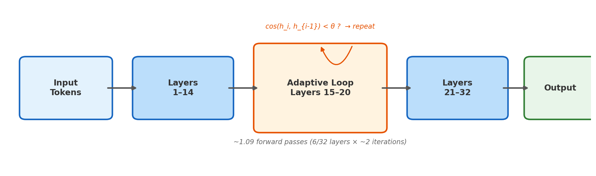
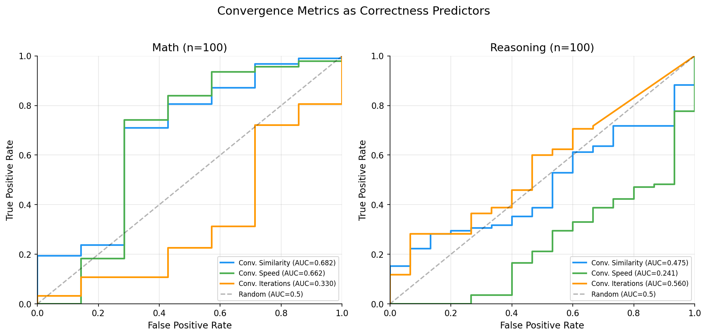
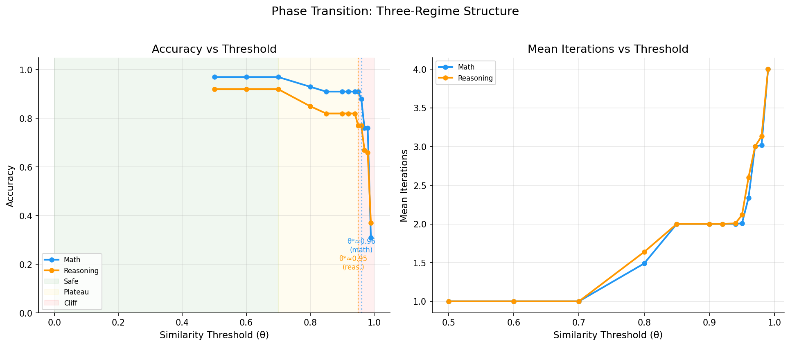
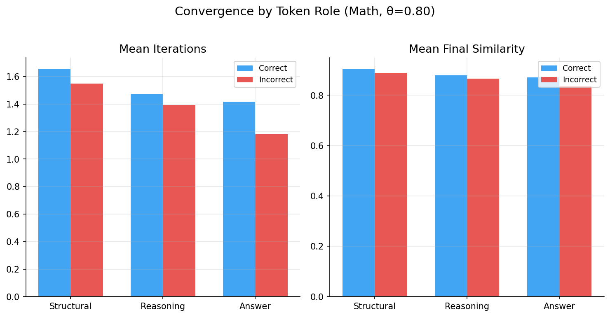
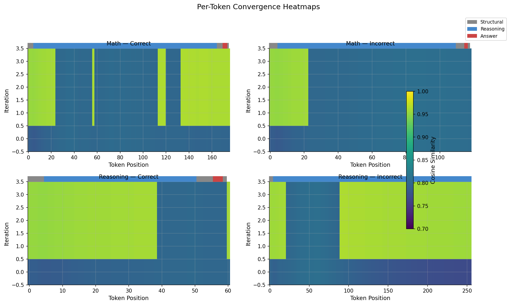
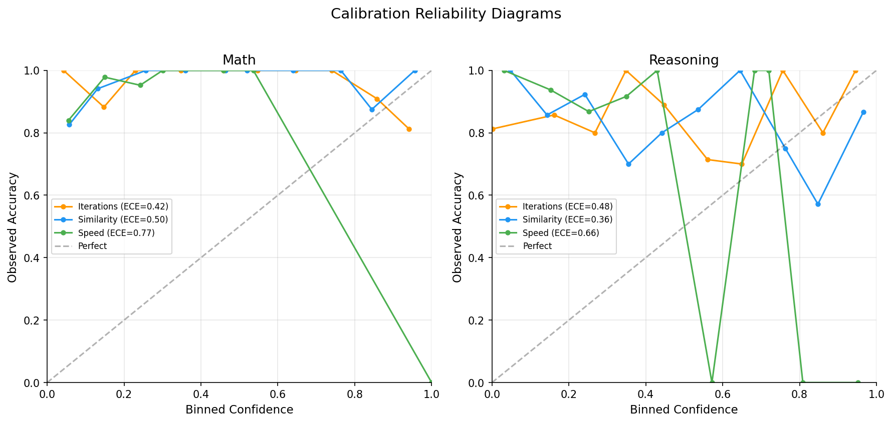
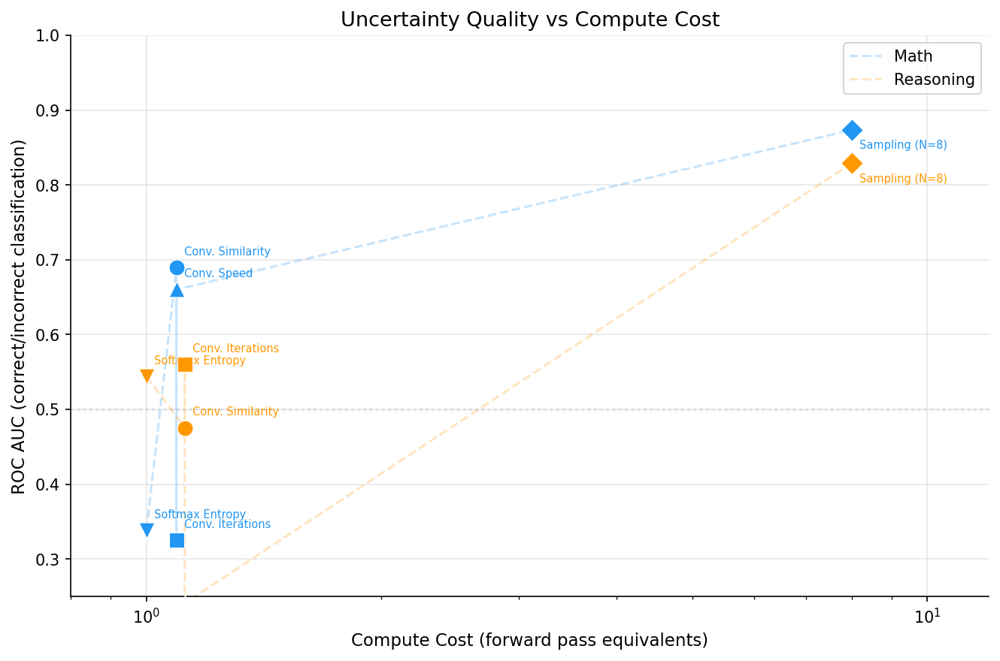
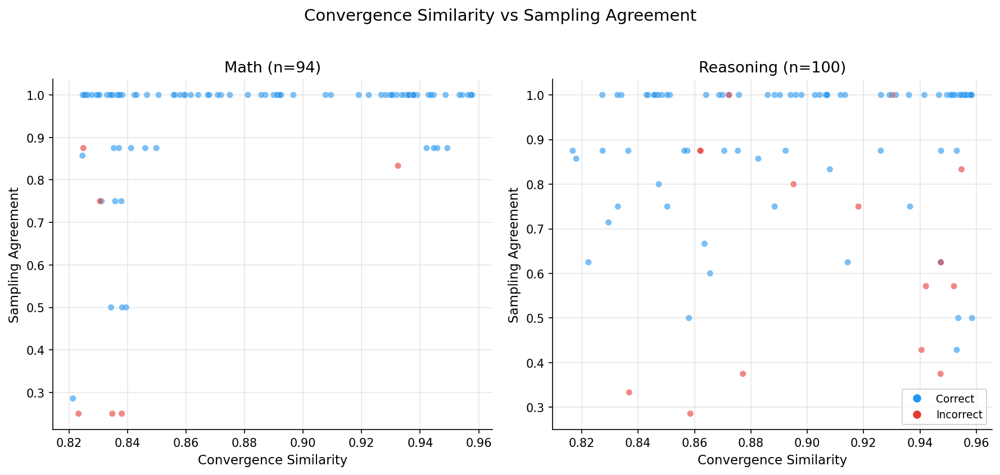
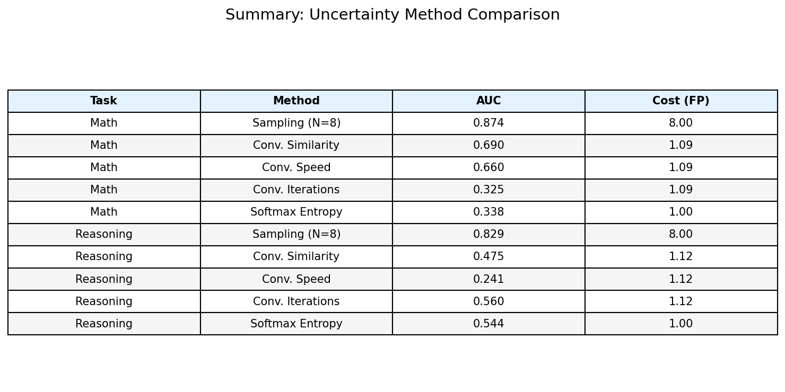

# Convergence as Uncertainty: What Adaptive Inference Reveals About How Transformers Think

## TL;DR

We ran the mid-layers of a transformer repeatedly until its hidden states stabilized, and used convergence speed as a cheap uncertainty signal. For math problems, this predicts correctness (AUC=0.69) at 14% the cost of sampling-based uncertainty. For reasoning problems, the signal **inverts** — the model converges *harder* on wrong answers. This task-dependent behavior reveals something interesting about how transformers process different types of information.

---

## The Problem

Large language models are confident liars. They produce fluent, well-structured text with no built-in indication of whether the content is correct. If you're deploying an LLM where correctness matters — math tutoring, code generation, medical Q&A — you need some way to estimate when the model is likely wrong.

The standard approach is **sampling-based uncertainty**: generate N outputs (typically 8) at elevated temperature and measure agreement. If all samples produce the same answer, the model is probably right. If they diverge, it's uncertain. This works well — we measure AUC=0.87 for math — but costs 8× the compute of a single generation. For latency-sensitive or budget-constrained applications, that's often prohibitive.

We found a cheaper signal hiding in the inference dynamics themselves.

## The Idea

**Adaptive recursive inference** runs a subset of transformer layers — the "circuit block" — repeatedly until the hidden-state representations stabilize. At each iteration, we measure the cosine similarity between the current and previous hidden states. When similarity exceeds a threshold θ, we stop iterating and continue through the remaining layers to produce output.

*Fig 1: Adaptive recursive inference. Layers 15–20 of Qwen2.5-7B run repeatedly until hidden-state cosine similarity exceeds threshold θ, or a maximum of 4 iterations is reached.*

The hypothesis is simple: **convergence behavior is informative**. A model that stabilizes quickly might be more confident — and more likely correct — than one that keeps iterating. If so, convergence metrics (final similarity, iteration count, convergence speed) serve as a near-free uncertainty signal: they cost roughly 1.09 forward-pass equivalents, since only 6 of 32 layers iterate and the average problem needs about 2 iterations.

We tested this on **Qwen2.5-7B-Instruct** with layers 15–20 as the circuit block and constrained JSON decoding via `outlines`. The model produces `{"reasoning": "...", "answer": N}` directly — no answer extraction noise. Our evaluation set: 100 math problems (arithmetic, algebra, number theory from GSM8K and MATH) and 100 multi-step reasoning problems with difficulty labels and ground-truth answers.

## The Surprise

For math, convergence works exactly as hypothesized. Problems the model gets right converge faster (higher final similarity, fewer iterations) than problems it gets wrong. The ROC AUC for convergence similarity as a correctness predictor is **0.69** — not spectacular, but usefully above chance and available essentially for free.

For reasoning, the signal **inverts**. The correlation between convergence similarity and correctness is *negative* (r = -0.38 at θ=0.95). The model converges *harder* on problems it gets wrong. It confidently stabilizes on incorrect reasoning chains.

*Fig 2: ROC curves for convergence metrics as correctness predictors. Left: math (AUC up to 0.69). Right: reasoning (near-chance or inverted — convergence fails as an uncertainty signal).*

This isn't a failure of the method — it's a finding about how transformers work. When a transformer solves an arithmetic problem, the computation is largely **internal**: the answer depends on manipulating numbers through learned circuits. Convergence of hidden states reflects whether those circuits are reaching a stable answer. Quick convergence → stable computation → likely correct.

When a transformer handles a multi-step reasoning problem, the computation is more **context-dependent**: the answer depends on correctly tracking premises, relationships, and implications from the prompt. The model's internal representations can stabilize (converge) while still being wrong about the external reasoning chain. Worse, the model may converge *more* confidently on familiar-seeming patterns that happen to be incorrect.

## Three Regimes

To understand the convergence dynamics more precisely, we swept the similarity threshold θ from 0.50 to 0.999. The results reveal a clean three-regime structure:

**Safe (θ ≤ 0.70):** The threshold is so low that everything converges in one iteration. Accuracy is at baseline (97% math, 92% reasoning). The model barely iterates — there's no variance in convergence behavior to exploit as a signal.

**Plateau (θ = 0.80–0.95):** The threshold is high enough to require ~2 iterations on average. Accuracy degrades mildly (91% math, 77–82% reasoning). This is the useful operating regime — there's variance in convergence behavior, and the convergence metrics are most discriminative here.

**Cliff (θ ≥ 0.96):** Accuracy collapses sharply. The threshold demands such high similarity that the model hits max iterations (4) on most problems, and the forced iteration disrupts rather than refines the representations. Both task types degrade to ~35% accuracy at θ=0.99.

The critical threshold θ* — where accuracy begins its cliff-edge collapse — is **task-dependent**: θ* ≈ 0.96 for math, θ* ≈ 0.95 for reasoning. Reasoning representations are less robust to forced iteration and destabilize at a lower threshold. This aligns with the hypothesis that reasoning representations are more fragile than arithmetic representations.

*Fig 3: Accuracy (left) and mean iterations (right) vs. similarity threshold θ. Shaded regions mark the three regimes. Vertical dashed lines indicate the task-specific critical θ*.*

## Where Uncertainty Lives

Moving from sequence-level to token-level analysis reveals where the model's uncertainty concentrates. We classified each generated token by its role in the constrained JSON output: **structural** (JSON syntax: `{`, `"reasoning":`, `}`), **reasoning** (the content of the reasoning field), and **answer** (the numeric answer tokens).

The results were counterintuitive. Structural tokens — which are deterministic given the JSON schema — converge the **slowest**, not the fastest. The model spends the most iterations stabilizing its representation of tokens that have only one valid option. This suggests the adaptive loop is doing deep representation refinement, not just answer computation.

Answer tokens converge fastest. And uncertainty localizes to **mid-reasoning tokens** (positions 50–150), where the model is working through the core logic of the problem.

For problems the model gets wrong, the convergence profile looks similar to correct problems through the early reasoning tokens but diverges in the middle. The model appears to "know" — at the representation level — that something is going wrong before it commits to the wrong answer.

*Fig 4: Mean iterations and final similarity by token role, split by correctness (math, θ=0.80). Structural tokens converge slowest; answer tokens converge fastest.*

*Fig 5: Per-token convergence heatmaps for representative problems. Each cell shows cosine similarity at (position, iteration). Top row: correct problems show uniform high similarity. Bottom row: incorrect problems show disruption in mid-reasoning positions.*

## Is the Signal Calibrated?

A useful uncertainty signal should be **calibrated**: when the signal says "80% confident," the model should be correct about 80% of the time. We binned problems by convergence metric value and measured actual accuracy per bin.

The best-calibrated metric differs by task type. For math, **iteration count** is best-calibrated (ECE = 0.19). For reasoning, **convergence speed** is well-calibrated (ECE = 0.10–0.12) — meaning it reliably tracks how likely the model is to be right, even though the absolute AUC is low.

But final similarity for reasoning is **anti-calibrated** (ECE = 0.61). When the signal says "high confidence," accuracy is actually *lower* than when it says "low confidence." This is the confident-wrong phenomenon from Section 3, now quantified: the model's similarity-based convergence signal actively misleads for reasoning tasks.

*Fig 6: Calibration reliability diagrams. The diagonal represents perfect calibration. Left: math. Right: reasoning, showing well-calibrated speed (ECE=0.10) alongside anti-calibrated similarity (ECE=0.61).*

## The Cost Question

How does convergence-based uncertainty compare to established methods? We benchmarked three approaches head-to-head:

1. **Convergence-based** (~1.09 forward passes): metrics extracted during adaptive inference
2. **Sampling-based** (8.0 forward passes): generate N=8 outputs at temperature=0.7, measure answer agreement
3. **Softmax entropy** (1.0 forward pass): mean per-token entropy from the model's output distribution

| Method | Math AUC | Reasoning AUC | Cost (FP) |
|--------|----------|---------------|-----------|
| Sampling (N=8) | **0.874** | **0.829** | 8.00 |
| Conv. Similarity | 0.690 | 0.475 | 1.09 |
| Conv. Speed | 0.660 | 0.524 | 1.09 |
| Conv. Iterations | 0.625 | 0.560 | 1.12 |
| Softmax Entropy | 0.338 | 0.544 | 1.00 |

Sampling dominates in raw discriminative power — AUC > 0.82 for both task types. But it costs 8× more compute.

For math, convergence similarity achieves **79% of sampling's AUC at 14% of the cost**. On a Pareto frontier of AUC vs. compute, convergence is the best option if your budget is under ~2 forward passes.

For reasoning, no cheap method is competitive with sampling. All convergence signals are near chance (AUC ≤ 0.56), and entropy is barely better (AUC = 0.54).

A striking negative result: **softmax entropy is worse than random for math** (AUC = 0.34). The model's token-level confidence distribution contains almost no information about answer correctness for arithmetic problems. Convergence captures something structural — the stability of internal representations across iterations — that per-token softmax probabilities miss entirely.

*Fig 7: AUC vs. compute cost for all uncertainty methods. Convergence methods cluster near the origin — low cost, moderate AUC for math. Sampling dominates but at 8× cost.*

*Fig 8: Convergence similarity vs. sampling agreement for each problem. Blue = correct, red = incorrect. For math (left), the two signals agree — high convergence + high sampling agreement strongly predicts correctness. For reasoning (right), the relationship breaks down.*

## What This Means

**For practitioners:** If you're running inference on computation-heavy tasks (arithmetic, algebra, structured problems with clear answers) and can't afford 8× sampling, convergence-based uncertainty is a viable alternative. Run adaptive inference with layers in the 40–60% depth range, set threshold θ ≈ 0.80–0.90, and use convergence speed or final similarity as your confidence score. But don't use it for context-heavy reasoning tasks — the signal will actively mislead you.

**For researchers:** The task-dependent behavior of convergence tells us something about transformer representations. Math representations have a property that reasoning representations lack: *correctness correlates with stability*. When a transformer "knows" an arithmetic answer, its internal state settles quickly. When it "knows" a reasoning answer, its internal state may settle just as firmly on a wrong answer. This asymmetry suggests that math and reasoning engage fundamentally different computational modes within the same model.

The **confident-wrong phenomenon** — convergence anti-correlating with correctness for reasoning — is perhaps the most interesting finding. It implies that transformers can reach stable attractor states that are confidently incorrect. The model isn't uncertain and guessing; it's certain and wrong. This has implications for interpretability: internal stability signals may be unreliable precisely when they matter most.

**Limitations:** This study uses a single model family (Qwen2.5-7B), a specific circuit block choice (layers 15–20), and relatively small evaluation sets (100 problems per task type). The three-regime structure and task-dependent θ* should be validated across model families and scales. The confident-wrong phenomenon may interact with model size — larger models might show different convergence dynamics for reasoning.

*Fig 9: Complete summary of uncertainty method comparison across tasks.*

## Methods

**Model:** Qwen2.5-7B-Instruct (32 layers). Circuit block: layers 15–20 (6 layers). Loaded with `device_map="auto"` on NVIDIA L40S (48GB VRAM).

**Adaptive inference:** Cosine similarity halting with `max_iterations=4`. Default threshold θ=0.80 for convergence trace collection. Phase transition sweep: 13 thresholds from θ=0.50 to θ=0.999.

**Datasets:** 100 math problems from GSM8K and MATH (arithmetic, algebra, number theory) and 100 multi-step reasoning problems, each with difficulty labels and step counts.

**Constrained decoding:** `outlines` library for guaranteed-valid JSON: `{"reasoning": "<string>", "answer": <integer>}`. This eliminates answer-extraction noise as a confound.

**Sampling baseline:** N=8 samples per problem at temperature=0.7 with JSON constraint. Uncertainty = fraction of samples agreeing on the majority answer.

**Entropy baseline:** Per-token softmax entropy from raw logits (before JSON constraint is applied to select the token). Aggregated as mean entropy across the generated sequence.

**Hardware:** Data collection on RunPod (NVIDIA L40S). Analysis and figure generation on Mac M1 Max (32GB).

**Code:** All code, data, and figures are available in this repository.
